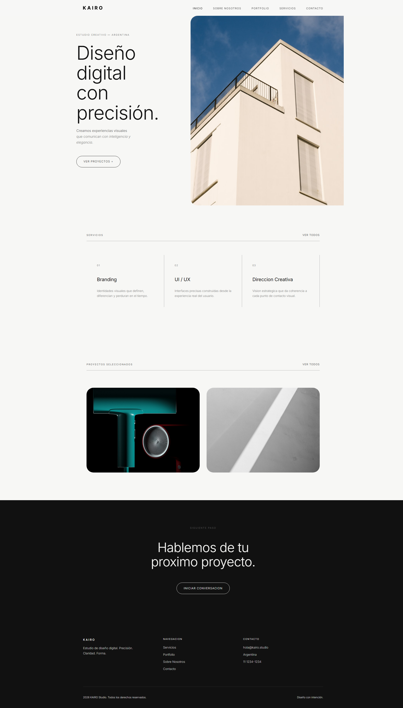
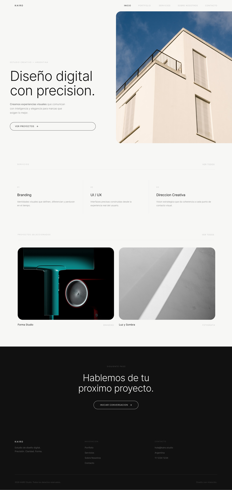

# Kairo Creative Studio

Sitio web de un estudio creativo ficticio, diseñado en Figma y luego maquetado en código.



**[Ver el diseño en Figma](https://www.figma.com/design/mWvzCcdDdTe7TSaPTA11KG/KAIRO-Creative-Studio)** · [Ver en vivo](#)

---

## Qué es

Kairo es una marca ficticia: un estudio creativo inventado para el trabajo final de la
Escuela Da Vinci. El proyecto integra dos materias — la identidad y el diseño de las
interfaces se produjeron en Diseño Gráfico I, y la maquetación e implementación en la
materia de desarrollo.

El sitio tiene cuatro secciones: home, sobre el estudio, servicios y portfolio, más
contacto. Las piezas que se muestran dentro del portfolio de Kairo son trabajos míos
reales, usados como contenido del estudio ficticio.

**Mi rol:** diseño de la interfaz en Figma e implementación completa en código.

---

## Del diseño al código

| Diseño en Figma | Resultado implementado |
|---|---|
|  |  |

El objetivo que me puse fue que la versión en el navegador fuera indistinguible de la
maqueta. Esa parte —la fidelidad— fue la más trabajosa del proyecto.

---

## Lo que aprendí traduciendo un diseño a código

**El ancho cambió a mitad de camino.** Diseñé en Figma sobre un lienzo de 1920 px,
aprovechando todo el ancho de pantalla. Ya empezada la maquetación, la consigna fijó un
contenedor de 1300 px como máximo. Hubo que recomponer las secciones para el nuevo
ancho: reajustar proporciones, márgenes y puntos de corte del contenido sin perder el
ritmo visual original. Se resolvió rápido, pero dejó una lección concreta: **una decisión
de layout tomada en el lienzo no es neutral**. Diseñar sabiendo cuál va a ser el
contenedor real evita rehacer trabajo.

**Codear funciona como auditoría del diseño.** Al pasar la maqueta a HTML aparecieron
cosas que en Figma no había visto: errores tipográficos en los textos, subtítulos
faltantes que rompían la jerarquía de lectura, secciones que necesitaban un `article`
propio para tener sentido semántico. Revisar un diseño desde la estructura del documento
es distinto que revisarlo desde el lienzo, y encuentra otros problemas.

---

## Decisiones técnicas

- **HTML5 semántico**, sin tablas de maquetación ni atributos de presentación en las
  etiquetas: todo el formato sale del CSS.
- **Una única hoja de estilos** para todo el sitio, más `reset.css` para normalizar el
  render entre navegadores.
- **Variables CSS con `:root`** para centralizar paleta y tipografías — una técnica que
  no se vio en la cursada, incorporada para que los estilos fueran realmente reutilizables.
- **Animaciones de entrada y transiciones CSS3** ligadas a la interacción del usuario.
- **JavaScript** sumado por encima de lo pedido, para el comportamiento de la interfaz.
- **Iconografía SVG** de [Lucide Icons](https://lucide.dev).
- Navegación principal y de redes construidas con listas desordenadas y CSS.

**Una restricción particular de la consigna:** estaba prohibido incluir comentarios en el
HTML y el CSS. Por eso el código no está comentado — la legibilidad se sostiene desde el
nombre de las clases y el orden de la hoja de estilos.

---

## Stack

HTML5 · CSS3 · JavaScript

---

## Estructura

```
/
├── index.html
├── pages/
│   ├── about.html
│   ├── service.html
│   ├── portfolio.html
│   └── contacto.html
├── css/
│   └── style.css
└── assets/
    └── svg_icons/
```

---

## Cómo verlo

```bash
git clone https://github.com/iTzTomitox/Kairo.git
cd Kairo
```

Abrí `index.html` en el navegador, o usá la extensión Live Server de VS Code.

---

**Tomas Beron** — [Portfolio](https://portfolio-tomas-beron.vercel.app) · [LinkedIn](https://linkedin.com/in/tomas-beron) · [Behance](https://behance.net/tomasberon)
